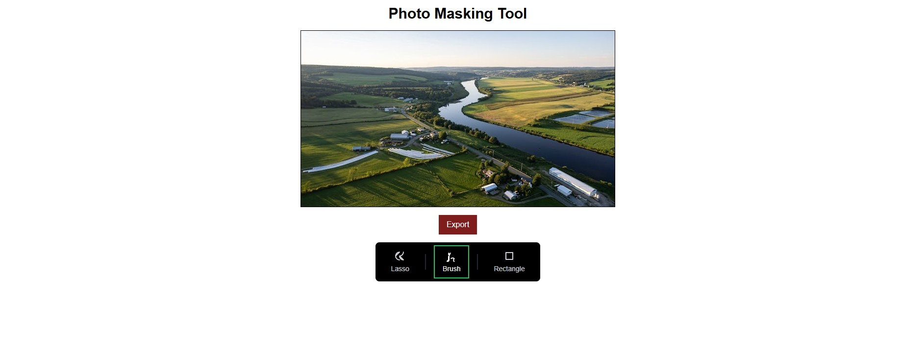
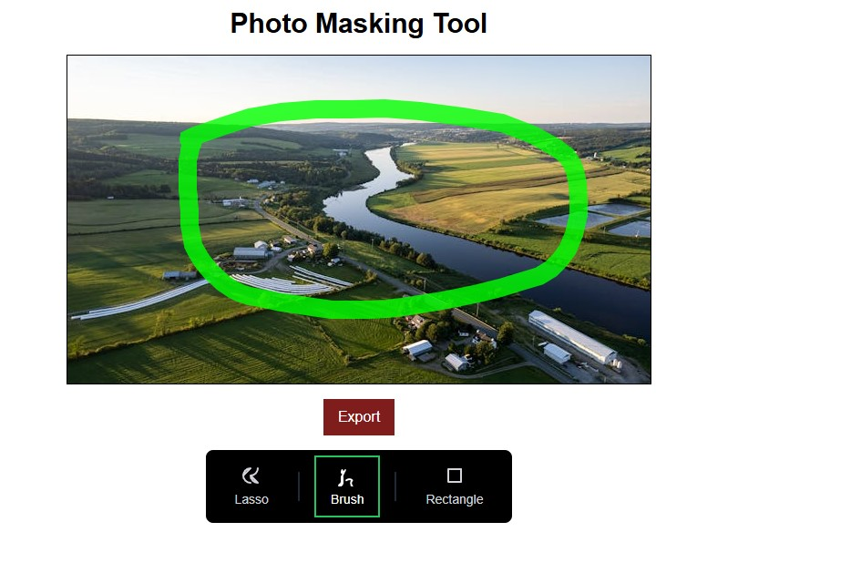
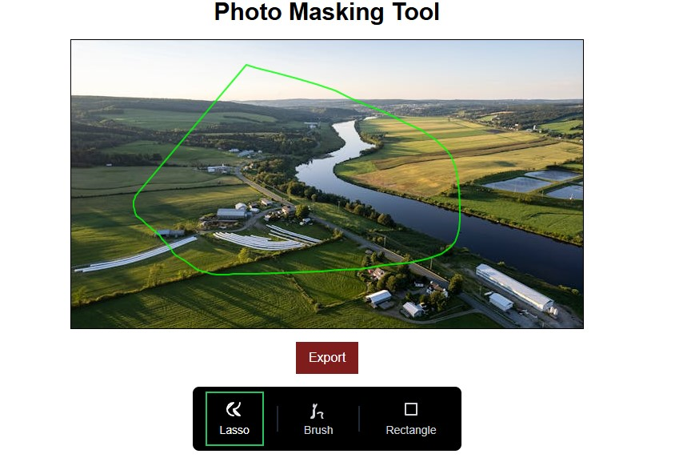
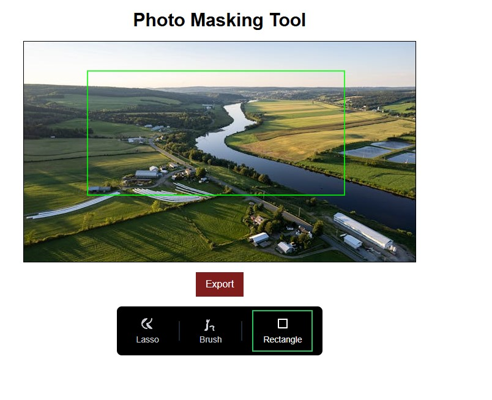
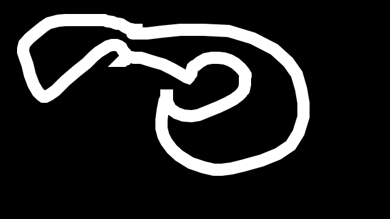
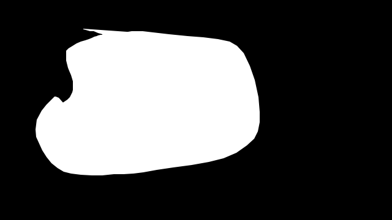
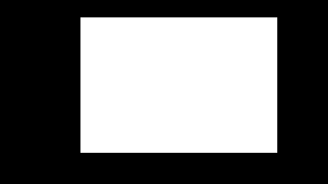

# Frontend Case: Masking Tool

This project is a frontend application for creating and managing masks on an image using interactive tools like **Lasso**, **Brush**, and **Rectangle**. Users can load an image, draw masks on it, and export the mask data in a black-and-white format.

---

## Features

### 1. Photo Upload
- Users can upload an image in **PNG**, **JPEG**, or **JPG** format.
- Uploaded images are displayed in the drawing area for further actions.

### 2. Mask Tools
- **Lasso Tool**:
  - Allows users to draw a polygon mask by clicking multiple points.
  - The points are connected to form a closed polygon.

- **Brush Tool**:
  - Enables freehand drawing by dragging the mouse over the image.
  - Suitable for more organic and detailed mask creation.

- **Rectangle Tool**:
  - Lets users draw rectangular or square masks by clicking and dragging the mouse.

### 3. Export Functionality
- The masked area can be exported as a black-and-white image.
- Non-masked areas are set to black, and the masked area is white.

---

## Technologies Used

- **Framework**: [Next.js](https://nextjs.org/) (v13+ with App Router)
- **Styling**: [Tailwind CSS](https://tailwindcss.com/)
- **Language**: TypeScript
- **Canvas API**: Used for real-time drawing and rendering on the image.

---

## Project Structure

```plaintext
photo-masking-tool/
├── src/
│   ├── app/
│   │   ├── page.tsx           # Main page component
│   │   ├── globals.css        # Global styles
│   │   ├── layout.tsx         # Global layout
│   ├── components/
│   │   ├── PhotoUploader.tsx  # Image upload functionality
│   │   ├── MaskTool.tsx       # Interactive drawing tools
│   │   ├── Toolbar.tsx        # Toolbar component
├── tailwind.config.js         # Tailwind configuration
├── tsconfig.json              # TypeScript configuration
└── package.json               # Project dependencies
```

---

## Setup Instructions

### 1. Clone the Repository
```bash
git clone https://github.com/your-username/frontend-case.git
cd frontend-case
```

### 2. Install Dependencies
```bash
npm install
```

### 3. Run the Development Server
```bash
npm run dev
```
- Open your browser and navigate to `http://localhost:3000`.

---

## How to Use

1. **Upload Image**:
   - Click the `Add Photo` button and upload an image.

2. **Select a Tool**:
   - Choose one of the tools (**Lasso**, **Brush**, or **Rectangle**) from the toolbar.

3. **Draw Masks**:
   - Use the selected tool to draw on the image.

4. **Export Mask**:
   - Click the `Export` button to save the mask as a black-and-white image.

---

## Screenshots

### Masking Tools





### Exported Mask Example




